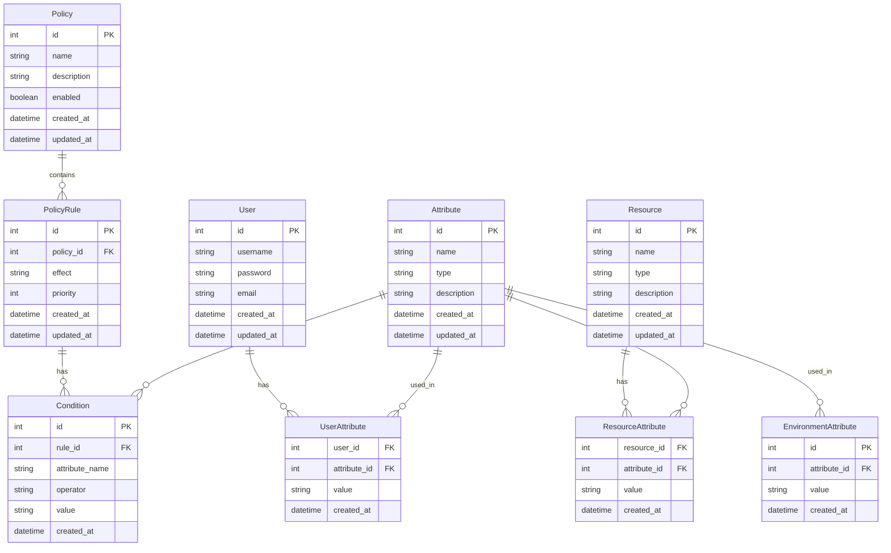
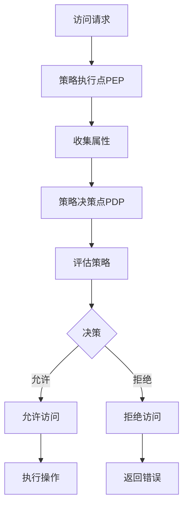
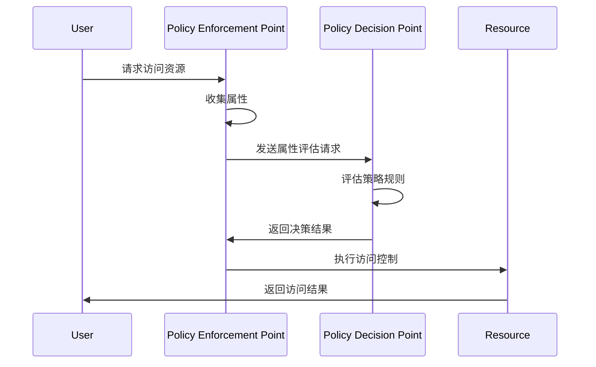
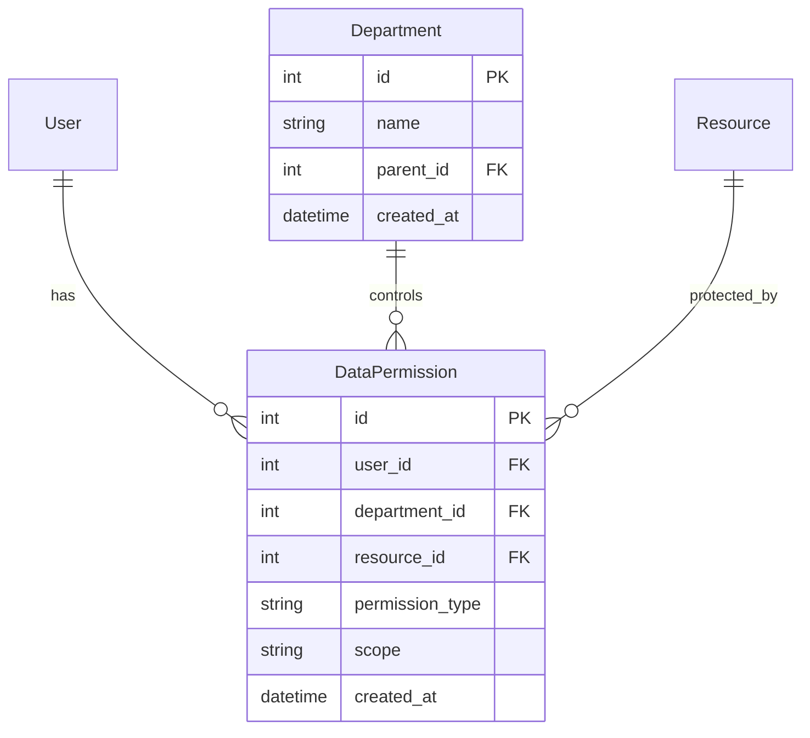
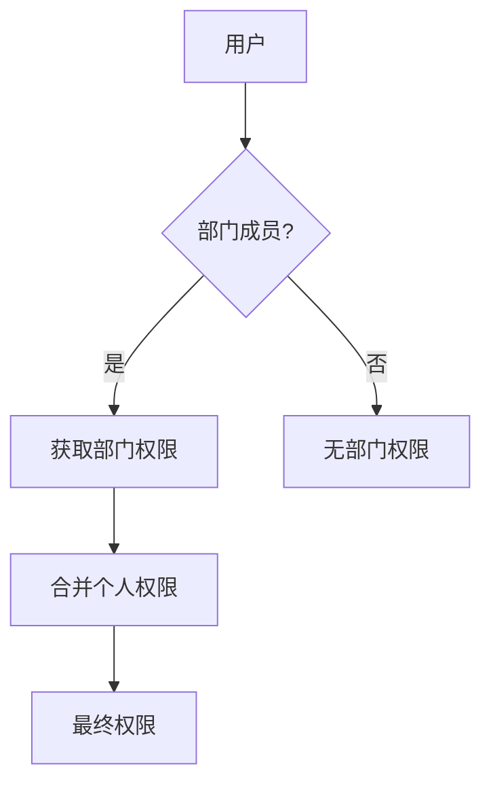

# 深入浅出ABAC权限设计

## 什么是ABAC？

ABAC（Attribute-Based Access Control，基于属性的访问控制）是一种更细粒度的访问控制模型，它通过评估主体（用户）、客体（资源）、操作和环境的各种属性来决定是否允许访问。相比RBAC，ABAC提供了更灵活和动态的访问控制机制。

## ABAC的核心概念

### 1. 属性（Attributes）
- **主体属性**：用户的特征（如角色、部门、职位等）
- **客体属性**：资源的特征（如类型、所有者、敏感级别等）
- **环境属性**：访问时的上下文（如时间、位置、设备等）
- **操作属性**：要执行的动作（如读、写、删除等）

### 2. 策略（Policy）
- 定义访问控制规则
- 基于属性评估结果做出决策
- 支持复杂的条件组合

### 3. 策略执行点（PEP）
- 拦截访问请求
- 收集相关属性
- 执行访问控制决策

### 4. 策略决策点（PDP）
- 评估访问请求
- 应用策略规则
- 做出访问决策

## ABAC的数据库设计



## ABAC的实现流程



## ABAC的权限检查流程



## 扩展的权限控制模型

### 1. 数据权限控制



### 2. 部门权限控制



## 实现示例

### 1. 创建属性
```sql
INSERT INTO attributes (name, type, description)
VALUES ('department', 'string', '用户所属部门');
```

### 2. 定义策略规则
```sql
INSERT INTO policies (name, description, enabled)
VALUES ('department_access', '部门访问控制策略', true);

INSERT INTO policy_rules (policy_id, effect, priority)
VALUES (1, 'allow', 1);

INSERT INTO conditions (rule_id, attribute_name, operator, value)
VALUES (1, 'user.department', 'equals', 'IT');
```

### 3. 分配数据权限
```sql
INSERT INTO data_permissions (user_id, department_id, resource_id, permission_type, scope)
VALUES (1, 1, 1, 'read', 'department');
```

## 最佳实践

1. **属性设计原则**
   - 属性应该具有明确的语义
   - 避免属性之间的冗余
   - 考虑属性的可扩展性

2. **策略管理**
   - 策略应该模块化和可重用
   - 定期审查和更新策略
   - 实现策略版本控制

3. **性能优化**
   - 缓存常用的属性值
   - 优化策略评估算法
   - 实现策略预评估

4. **安全考虑**
   - 保护属性数据的完整性
   - 实现属性验证机制
   - 记录策略决策日志

## 总结

ABAC模型通过属性评估提供了更细粒度的访问控制，特别适合需要动态权限控制的场景。结合数据权限和部门权限，可以构建一个完整的权限管理体系：

1. 基于角色的基础权限控制（RBAC）
2. 基于属性的细粒度控制（ABAC）
3. 基于数据范围的权限控制
4. 基于组织结构的权限控制

通过合理使用这些模型，可以实现：
- 更精确的权限控制
- 更灵活的权限管理
- 更好的可扩展性
- 更强的安全性 