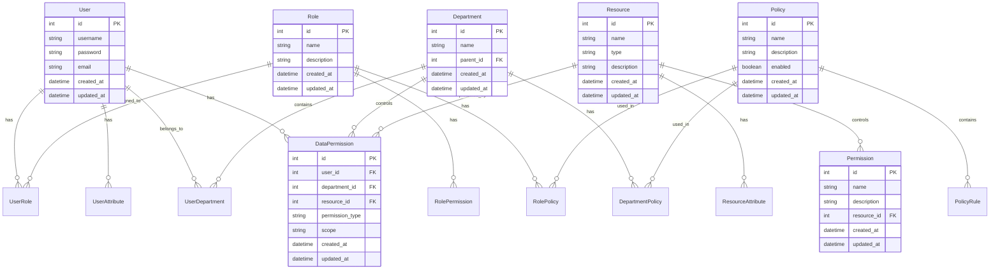

# 综合权限控制模型设计

## 模型概述

本文档描述了一个综合的权限控制模型，它结合了：
1. 基于角色的访问控制（RBAC）
2. 基于属性的访问控制（ABAC）
3. 数据权限控制
4. 部门权限控制

## 综合数据库设计



## 权限控制流程


## 数据权限控制

### 1. 数据权限类型
- 全部数据权限
- 部门数据权限
- 部门及以下数据权限
- 仅本人数据权限
- 自定义数据权限

### 2. 数据权限实现


## 部门权限控制

### 1. 部门树结构


### 2. 部门权限继承


## 实现示例

### 1. 创建用户并分配角色和部门
```sql
-- 创建用户
INSERT INTO users (username, password, email)
VALUES ('john.doe', 'hashed_password', 'john@example.com');

-- 分配角色
INSERT INTO user_roles (user_id, role_id)
VALUES (1, 1);

-- 分配部门
INSERT INTO user_departments (user_id, department_id)
VALUES (1, 1);
```

### 2. 设置数据权限
```sql
-- 设置部门数据权限
INSERT INTO data_permissions (user_id, department_id, resource_id, permission_type, scope)
VALUES (1, 1, 1, 'read', 'department');

-- 设置个人数据权限
INSERT INTO data_permissions (user_id, resource_id, permission_type, scope)
VALUES (1, 2, 'write', 'personal');
```

### 3. 定义访问策略
```sql
-- 创建策略
INSERT INTO policies (name, description, enabled)
VALUES ('department_data_access', '部门数据访问策略', true);

-- 添加策略规则
INSERT INTO policy_rules (policy_id, effect, priority)
VALUES (1, 'allow', 1);

-- 设置条件
INSERT INTO conditions (rule_id, attribute_name, operator, value)
VALUES (1, 'user.department', 'equals', 'IT');
```

## 最佳实践

1. **权限分层设计**
   - 基础权限（RBAC）
   - 细粒度权限（ABAC）
   - 数据权限
   - 部门权限

2. **权限缓存策略**
   - 缓存用户角色
   - 缓存部门权限
   - 缓存数据权限
   - 定期更新缓存

3. **权限审计**
   - 记录权限变更
   - 记录访问日志
   - 定期权限审查
   - 异常访问监控

4. **性能优化**
   - 使用权限缓存
   - 优化权限查询
   - 批量权限检查
   - 异步权限验证

## 总结

综合权限控制模型通过结合多种权限控制机制，提供了：
1. 灵活的角色管理
2. 细粒度的属性控制
3. 精确的数据权限
4. 清晰的部门权限

这种模型特别适合：
- 大型企业应用
- 多租户系统
- 需要细粒度控制的场景
- 复杂的组织架构 