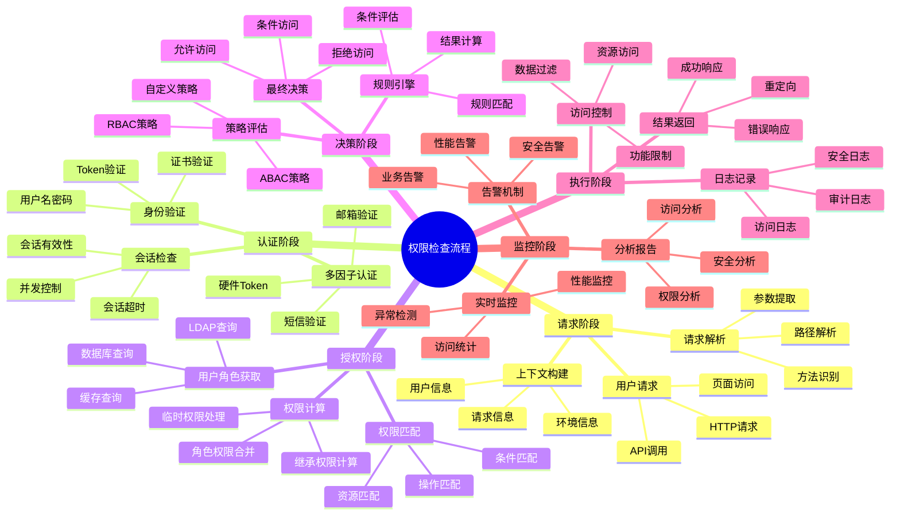

# RBAC权限模型XMind结构图

## 完整的RBAC权限控制流程结构

## RBAC系统架构结构图

## RBAC权限检查流程结构图

## RBAC数据模型结构图

这个XMind结构图涵盖了RBAC权限模型的完整流程，包括：

1. **完整的RBAC权限控制流程结构** - 展示了从用户管理到审计监控的完整流程
2. **RBAC系统架构结构图** - 展示了系统的分层架构
3. **RBAC权限检查流程结构图** - 详细展示了权限检查的各个阶段
4. **RBAC数据模型结构图** - 展示了数据库设计的核心实体和关系

这些结构图可以帮助您：
- 理解RBAC系统的整体架构
- 掌握权限检查的详细流程
- 了解数据模型的设计思路
- 指导系统的开发和实施

您可以将这些结构导入到XMind软件中进行进一步的编辑和完善。 