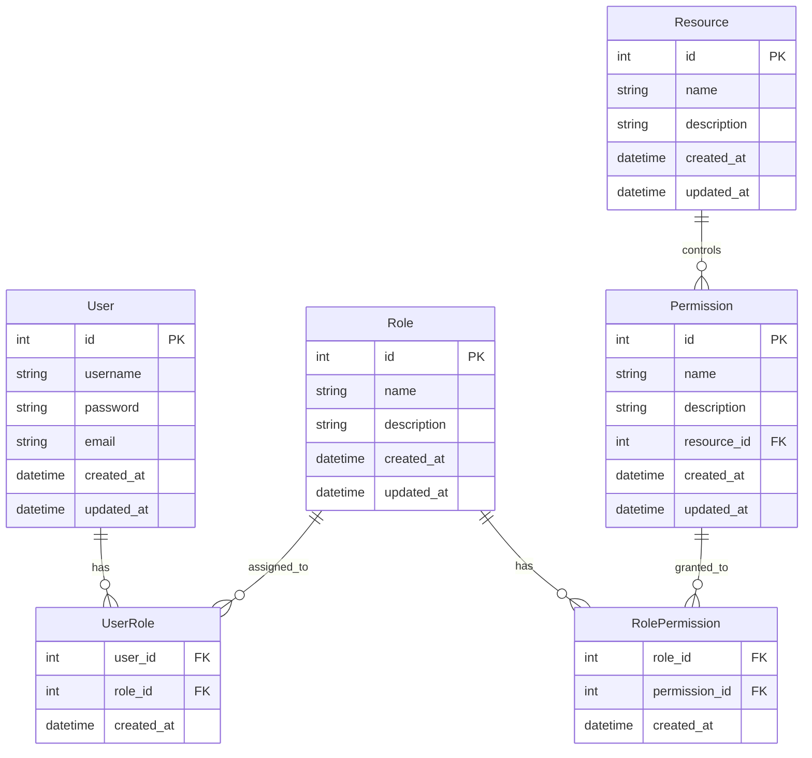
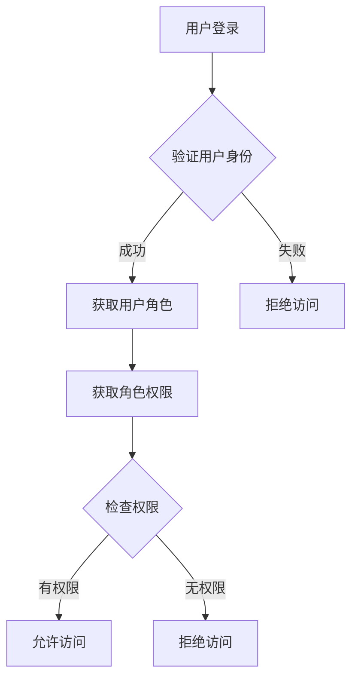
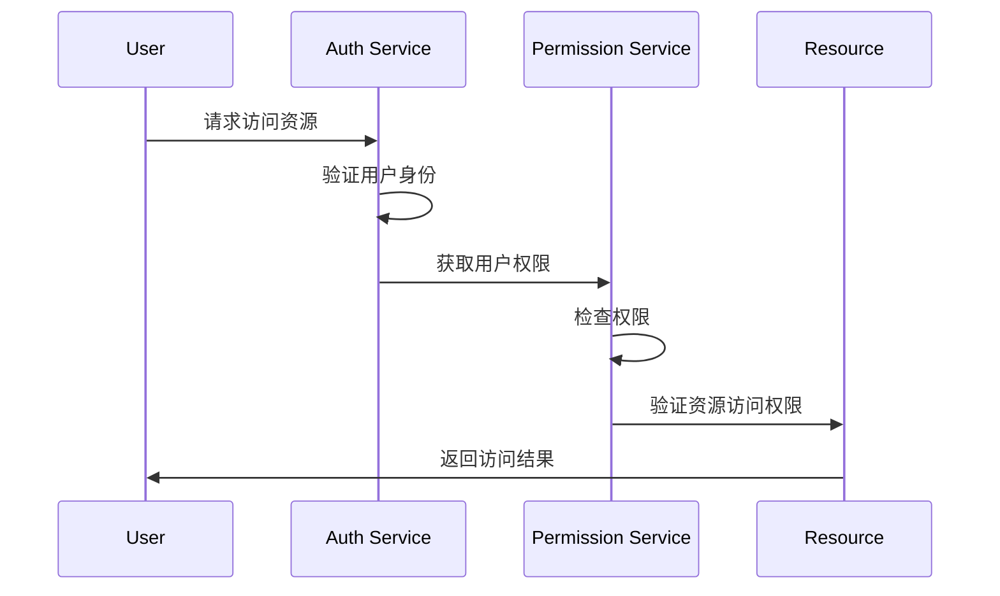

# 深入浅出RBAC权限设计

## 什么是RBAC？

RBAC（Role-Based Access Control，基于角色的访问控制）是一种访问控制机制，它通过定义角色和权限之间的关系来管理用户对系统资源的访问。RBAC模型的核心思想是将权限与角色关联，而不是直接与用户关联，从而简化权限管理。

## RBAC的核心概念

### 1. 用户（User）
- 系统的使用者
- 可以拥有一个或多个角色

### 2. 角色（Role）
- 权限的集合
- 代表一组特定的操作权限
- 例如：管理员、普通用户、访客等

### 3. 权限（Permission）
- 对特定资源的操作权限
- 通常表示为：资源:操作
- 例如：user:create, user:read, user:update, user:delete

### 4. 资源（Resource）
- 系统中需要被保护的对象
- 例如：用户、文章、评论等

## RBAC的数据库设计



## RBAC的实现流程



## RBAC的权限检查流程



## RBAC的最佳实践

1. **最小权限原则**
   - 只授予用户完成工作所需的最小权限
   - 定期审查和更新权限

2. **角色设计原则**
   - 角色应该具有明确的职责范围
   - 避免角色之间的权限重叠
   - 使用角色继承来简化权限管理

3. **权限粒度控制**
   - 合理划分权限粒度
   - 支持细粒度的权限控制
   - 考虑使用权限组来管理相关权限

4. **审计和日志**
   - 记录所有权限变更
   - 定期审查权限使用情况
   - 实现权限操作的追踪机制

## 实现示例

### 1. 创建角色
```sql
INSERT INTO roles (name, description) 
VALUES ('admin', '系统管理员');
```

### 2. 分配权限
```sql
INSERT INTO role_permissions (role_id, permission_id)
VALUES (1, 1); -- 为管理员角色分配权限
```

### 3. 用户角色关联
```sql
INSERT INTO user_roles (user_id, role_id)
VALUES (1, 1); -- 为用户分配管理员角色
```

## 总结

RBAC是一种强大而灵活的权限管理模型，它通过角色这个中间层，有效地解决了权限管理的复杂性问题。合理使用RBAC可以：

1. 简化权限管理
2. 提高系统安全性
3. 降低维护成本
4. 支持灵活的权限调整

通过本文的介绍，希望您能够更好地理解和应用RBAC模型，为您的系统设计一个安全、高效的权限管理系统。
