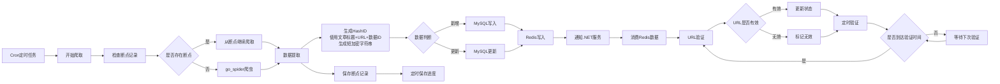

# demo

| 项目     | 描述                                    | 地址             |
| -------- | -------------------------------------- | ---------------- |
| 鱼鱼助手 | [脚本助手](/docs/other/auto/README.md) | https://api-y.cn  |
| 云盘搜索 |            云盘搜索                   | https://yuyu.api-y.cn |

## 云盘搜索
- 使用NET8、Mysql、Elasticsearch、Hangfire、redis、Mediator中介者、RabbitMQ(暂时取消)
-  https://github.com/hu17889/go_spider

# 云盘搜索项目技术文档

## 项目概述
本项目是一个基于 Go 语言开发的云盘搜索系统，使用 go_spider 框架进行数据爬取，结合 .NET 8 后端服务进行数据处理和验证。系统支持断点续爬功能，确保数据爬取的连续性和完整性。

## 技术架构
- 爬虫框架：go_spider (https://github.com/hu17889/go_spider)
- 后端服务：.NET 8
- 数据存储：MySQL + Redis
- 开发语言：Go + C#

## 系统流程

### 1. 数据爬取流程
1. 使用 go_spider 框架爬取目标网站数据
2. 支持断点续爬功能：
   - 记录上次爬取位置
   - 保存爬取进度
   - 支持任务中断恢复
3. 提取关键信息：数据ID、URL、文章标题
4. 生成唯一标识 HashID
5. 数据清洗和格式化

### 2. 数据存储流程
1. 根据 HashID 判断数据是新增还是更新
2. 批量写入 MySQL 数据库
3. 将数据写入 Redis 队列
4. 发送 HTTP 通知到 .NET 8 后端服务

### 3. 数据验证流程
1. .NET 8 后端服务消费 Redis 队列数据
2. 根据数据类型进行 URL 有效性验证
3. 更新数据状态（有效/无效）
4. 定时任务验证 URL 有效性

## 流程图

## 关键功能说明

### 1. 定时任务
- 使用 Cron 表达式配置爬虫执行时间
- 支持灵活的任务调度策略
- 可配置多个时间点执行

### 2. 断点续爬功能
- 支持任务中断恢复
- 记录爬取进度和位置
- 定时保存断点信息
- 支持多任务并行爬取
- 确保数据爬取的连续性

### 3. HashID 生成
- 基于数据ID、URL、文章标题生成唯一标识
- 使用加密算法生成短字符串
- 用于判断数据是新增还是更新
- 保证数据的唯一性和可追踪性

### 4. 数据存储
- MySQL：存储完整数据
- Redis：存储待处理数据队列

### 5. URL 验证
- 实时验证：数据入库时进行验证
- 定时验证：每天定时检查 URL 有效性

## 部署要求
1. Go 环境配置
2. .NET 8 运行环境
3. MySQL 数据库
4. Redis 服务

## 鱼鱼助手
