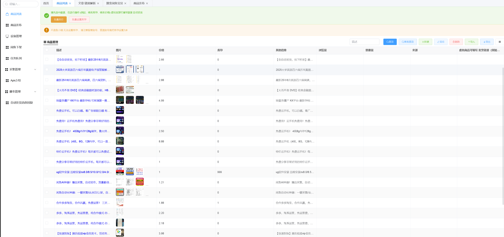
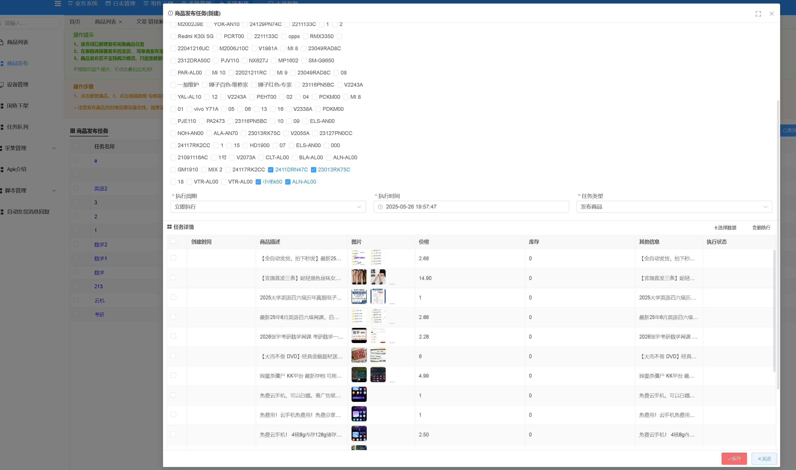
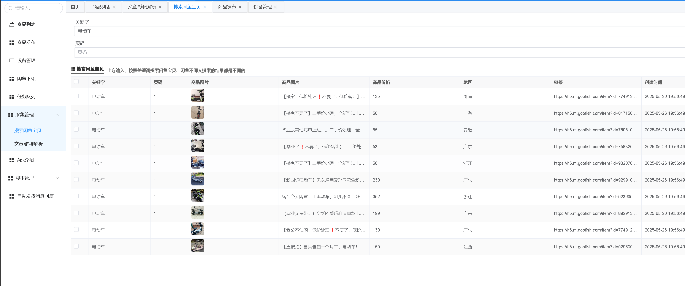

# 闲鱼自动化工具

- 支持全系列手机,安卓7.0以上免Root
- .PC端为SPA应用，支持Windows、Mac
- .发布类型支持一口价、免费送、拍卖、租房和会玩帖子
- 支持云控多台设备 同时发布、存草稿、删除帖子
- 支持XHS、闲鱼热搜 一键采集、发布功能
- 支持微信验证码零时登录、自动登录

### 链接
- PC链接 [鱼鱼助手](https://api-y.cn/#/)
- apk 需要进入 后台获取

### 流程
1. 下载安装包
2. 打开软件，登录 链接云控设备
3. 网页端配置 要发布的商品 

#### 商品管理
- 商品管理支持添加商品、删除商品、修改商品

#### 商品发布
- 可以多选设备 进行发布

#### 商品采集
- 商品采集采用的是 golangd 编写的 爬虫 开放的端口

#### 增加一个体验功能 有效期十分钟
-  