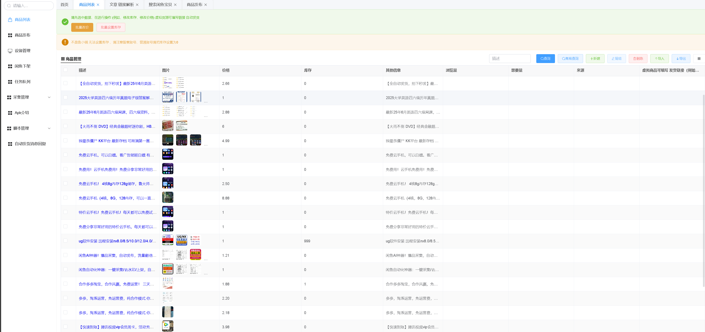
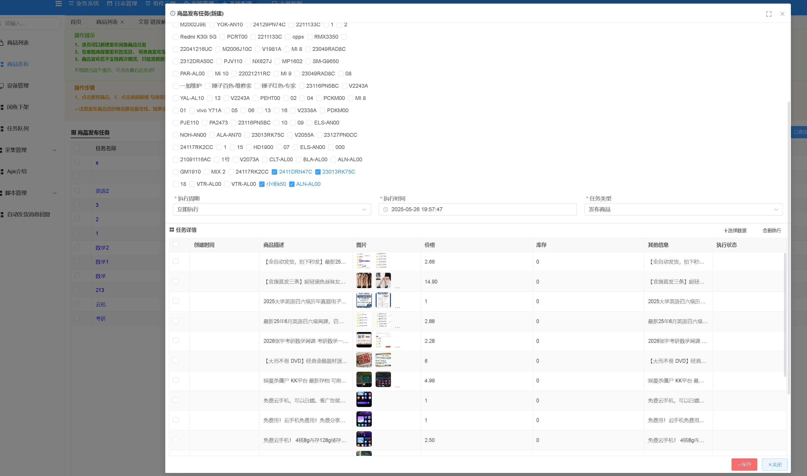
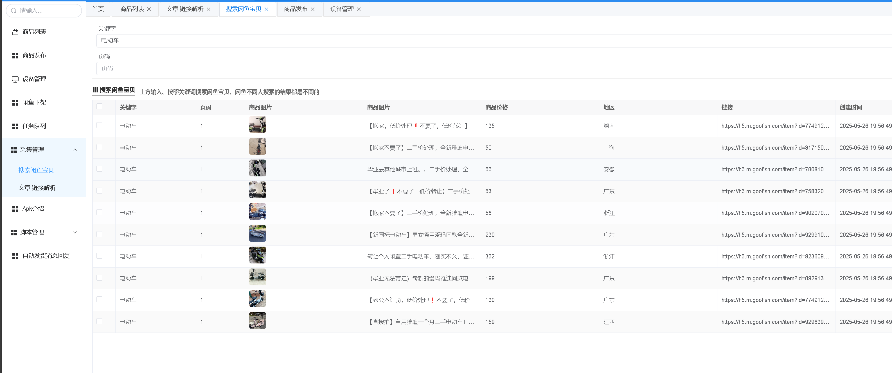

# 🎯闲鱼自动化工具

## 🚀鱼鱼助手
- 1️⃣使用NET8、Mysql、Hangfire、redis
- 2️⃣客户端使用autojs 7.0.1版本 、自动化脚本 使用在安卓端
- 3️⃣使用 vol 框架 开源版本 、（增加了一部分代码、中间件多级缓存、signlar 分组发送）
- 4️⃣后台管理使用 vue3 + element-plus 
- 5️⃣地址 [项目地址：https://api-y.cn](https://api-y.cn)

### 📋 项目概述
1. 🛠️ 本项目是一个基于 Net8 开发的后端服务，Autojs为客户端（安卓端）的自动化上货工具
2. ⚡ 使用vue3 开发后台商品管理、通过🌐websocket 连接设备（客户端）、进行下发脚本命令 执行自动化发布商品，支持1-N 台设备批量下发脚本命令（云控功能）。
3. 🔧 通过后台管理功能 对商品进行管理 统一设置价格 库存 等功能，实现一个地方维护 多台手机使用、多台APP使用（例如我有一个衣服的商品、现在需要发布到 某鱼、转转、小HS 等app） 只需要新建商品后、然后（🌐通过websocket连接后）发布到不同平台执行，就可对应多个app 进行发布功能

### 🎯 功能介绍

- ✅ **兼容性强** - 支持全系列手机,安卓7.0以上免Root - 支持Android 7.0+和主流手机品牌
- ✅ .PC端为SPA应用，支持Windows、Mac
- ✅ 支持云控多台设备 同时发布、存草稿 支持批量发布商品
- ✅ 支持根据浏览量和曝光量大小删除帖子
- ✅ 支持XHS、闲鱼热搜 一键采集采集商品、自动转换md5码 自动发布功能
- ✅ 支持微信验证码零时登录、自动登录

### 📌 项目优化版本更新新日志
> #### - 系统每周都会有数次更新，更新会整合一段时间后、统一发布

> ##### 紧急功能点
- ✅批量导入 提供一个数据格式导入数据库,方便用户快速接入数据功能 
> 1. 2025-06-03 （已完成 TODO 需要增加一个设置主图的功能）
- ✨监听自动发货功能 
> 1. 2025-06-03 （已完成Java 监听导航栏变化 TODO待测试）

- ✅批量采集数据 某鱼整店搬运 -(使用wpf + webview2 已实现) 后续新增-淘宝搬运采集
- ✨流程闭环 用户配置商品管理 --> 用户批量上架商品(多台不同设备 ) --> 上架完成或者失败 --> 上架完成后 监听已购买的商品

> 2025-05-31
- ✅ 优化了Ui界面卡顿功能、修复安卓不同版本-的添加水印问题 (使用Java包android.graphics)
- ✅ 修复悬浮日志不同脚本不显示bug
- ✅ 修复websocket 手机关闭断开bug、（手机锁屏、再次打开不会重连bug）
- ✅ 新增发布商品地址池功能（发布商品可以指定地区）、新增多种键盘广播（解决留言不能输入文字功能）

> 2025-01-30
- 完善了权限检测、不同安卓版本查找控件
- 多处细节优化 （主要测试各个不同安卓版本、不同手机型号bug问题）
- 新增图片MD5 码 （多台手机为不同图片md5码）

> 2024-12-10
- ✅ 增加了复制宝贝功能、任务队列、任务重试功能
- ✅ 增加图色查找控件、增加发布商品、存草稿功能
- ✅ 增加app热更新功能、远程调试功能
- ✅ 不同安卓版本图色查找功能、新增yolo v5模型，支持图片识别，提高识别速度(识别图片、返回点位、)
- ❌ 增加自动发货功能、（目前不太稳定、暂时关闭了）

> 2024-11-21
- ✅ webSocket 支持多台设备同时发布、云控功能
- ✅ 控件查找函数封装、远程下载图片到相册、悬浮窗口日志显示
- ✅ 上下架商品、任务队列重试

### 待开发功能
#### 产品编辑
- ✅ 商品宝贝地址池 (发布商品勾选发布位置,根据地址池可以随机地址) - 发布商品的时候可以勾选 或者 商品编辑的时候可以勾选地址池
- ❌宝贝水印自定义功能 (通过界面配置 添加文字水印等功能)
- ❌宝贝描述池功能 (app 发布具有描述功能)
- ❌宝贝标签池 (某鱼商品发布双击可以添加标签)
- ❌房屋出租功能
- ❌免费送宝贝发布功能
- ❌某鱼养号 - （翻动次数、点击概率、想要率、私信内容、收藏率、留言率、留言内容）
- ❌用户宝贝生成报表、分析用户

#### 商品管理

- 商品分组功能 (可以根据现有商品 把商品进行分组 批量分组,方便大批量数据 快速查询)
- 发布某鱼 (已经实现)
- 发布转转 (未实现)
- TODO暂定其他功能

#### 帖子管理

- 帖子编辑 (例如某鱼的发布帖子增加 账号活跃度)
- 帖子采集 (一键采集其他平台的帖子)
- 帖子列表管理 (可以查询 模糊匹配等功能)
- 帖子分组 (用于管理帖子列表 绑定分组)
- 帖子水印 
- 发布某鱼
- 发布红薯
- todo暂定功能

#### TODO 暂定 某鱼发布管理

### 链接
- PC链接 [鱼鱼助手](https://api-y.cn/#/)
- apk 需要进入 后台获取

### 流程
1. 下载安装包
2. 打开软件，登录 链接云控设备
3. 网页端配置 要发布的商品 

#### 商品管理
- 商品管理支持添加商品、删除商品、修改商品

#### 商品发布
- 可以多选设备 进行发布

#### 商品采集
- 商品采集采用的是 golangd 编写的 爬虫 开放的端口

#### 增加一个体验功能 有效期十分钟
- 
